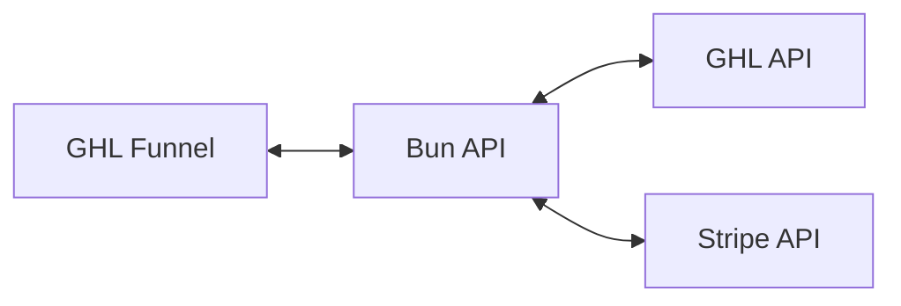

# Workshop Booking API

A Bun API server for workshop bookings with GHL integration and Stripe Embedded Checkout.



## Project Structure

```
src/
├── index.ts           # Server entry + routing
├── config.ts          # Environment configuration
├── types.ts           # TypeScript types
├── validation.ts      # Zod schemas
├── ghl-client.ts      # GHL SDK client
├── ghl.ts             # GHL API functions
├── handlers.ts        # Booking route handlers
├── stripe-client.ts   # Stripe SDK client
└── stripe-handlers.ts # Checkout + webhook handlers
```

## Setup

### 1. Install Dependencies

```bash
bun install
```

### 2. Configure Environment

```bash
cp .env.example .env
```

Required variables:

| Variable | Description |
|----------|-------------|
| `GHL_ACCESS_TOKEN` | GHL API access token |
| `GHL_LOCATION_ID` | GHL location ID |
| `WORKSHOP_OFFERINGS_SCHEMA` | Custom object schema ID for offerings |
| `BOOKINGS_SCHEMA` | Custom object schema ID for bookings |
| `CHECKOUT_BASE_URL` | URL to checkout page on GHL funnel |
| `CHECKOUT_SUCCESS_URL` | URL to confirmation page after payment |
| `STRIPE_SECRET_KEY` | Stripe secret key |
| `STRIPE_PUBLISHABLE_KEY` | Stripe publishable key |
| `STRIPE_WEBHOOK_SECRET` | Stripe webhook signing secret |

### 3. Run Development Server

```bash
bun run dev
```

Server starts at `http://localhost:3000`.

## API Endpoints

| Method | Endpoint | Description |
|--------|----------|-------------|
| GET | `/api/health` | Health check |
| GET | `/api/offerings?yearGroup=gcse` | Get available workshops |
| POST | `/api/bookings` | Create booking, returns checkout URL |
| POST | `/api/checkout/session` | Create Stripe checkout session |
| POST | `/api/webhooks/stripe` | Stripe webhook handler |

## Booking Flow

1. User submits form → `POST /api/bookings`
2. API creates booking (status: `pending`) → returns `checkoutUrl`
3. User redirected to GHL checkout page
4. Page calls `POST /api/checkout/session` → returns `clientSecret`
5. Stripe Embedded Checkout renders
6. User completes payment
7. Stripe sends webhook → `POST /api/webhooks/stripe`
8. API updates booking status to `paid`

## Testing

### Create Booking

```bash
curl -X POST http://localhost:3000/api/bookings \
  -H "Content-Type: application/json" \
  -d '{
    "offeringId": "xxx",
    "parent": {
      "firstName": "Jane",
      "lastName": "Doe",
      "email": "jane@example.com",
      "phone": "07123456789"
    },
    "student": {
      "firstName": "John",
      "lastName": "Doe",
      "email": "john@example.com",
      "phone": "07123456789"
    }
  }'
```

### Create Checkout Session

```bash
curl -X POST http://localhost:3000/api/checkout/session \
  -H "Content-Type: application/json" \
  -d '{
    "bookingId": "BK-XXX",
    "customerEmail": "test@example.com",
    "customerName": "Test User",
    "priceId": "price_xxx"
  }'
```

### Test Webhooks Locally

```bash
stripe listen --forward-to localhost:3000/api/webhooks/stripe
```

## Stripe Webhook Setup (Production)

1. Go to Stripe Dashboard → Developers → Webhooks
2. Add endpoint: `https://your-api.com/api/webhooks/stripe`
3. Select events:
   - `checkout.session.completed`
   - `checkout.session.expired`
4. Copy signing secret → set as `STRIPE_WEBHOOK_SECRET`

## Build & Deploy

```bash
bun run build
```

Creates `./dist/workshop-api` standalone binary.

### Deploy with PM2

```bash
pm2 start ./dist/workshop-api --name workshop-api
```

Set environment variables on your hosting platform.
